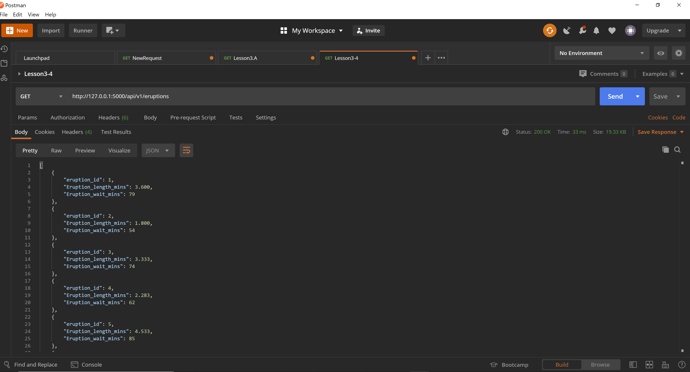
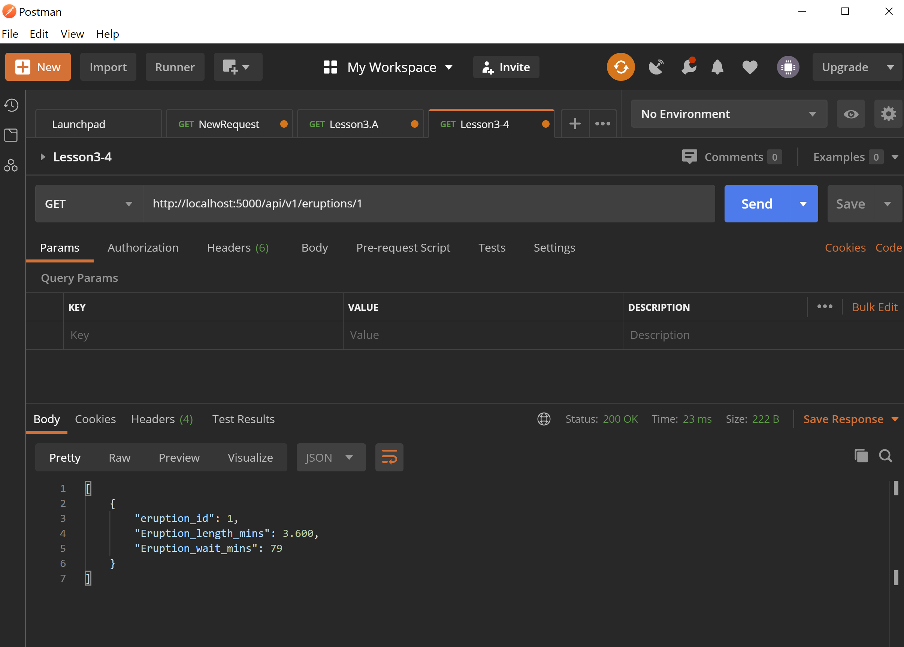
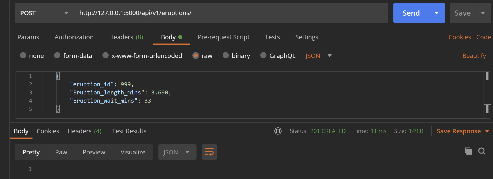
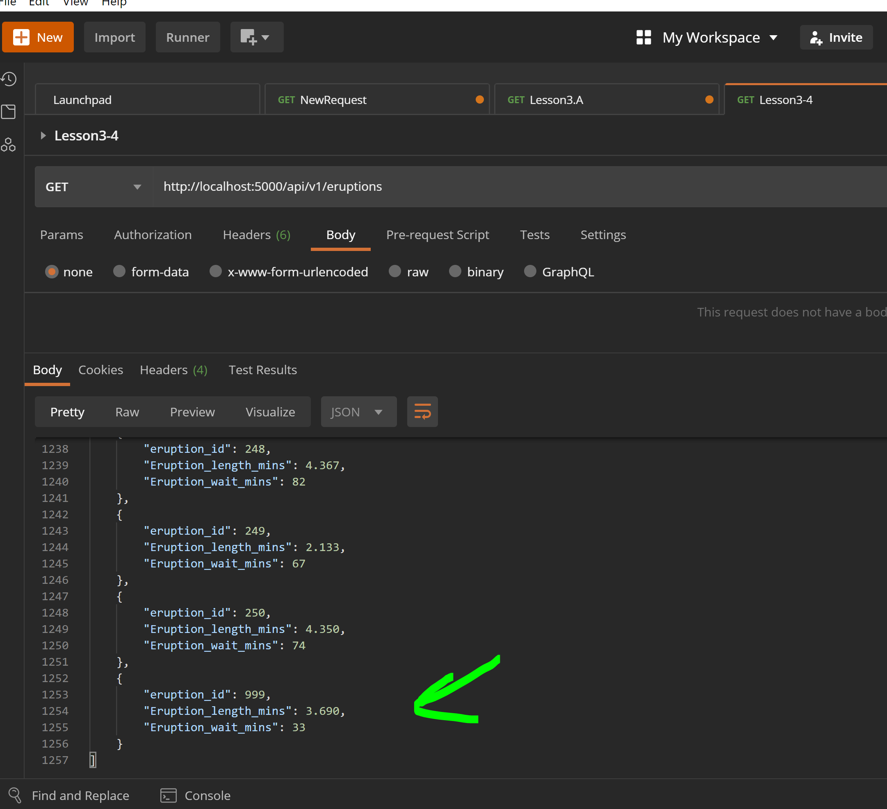
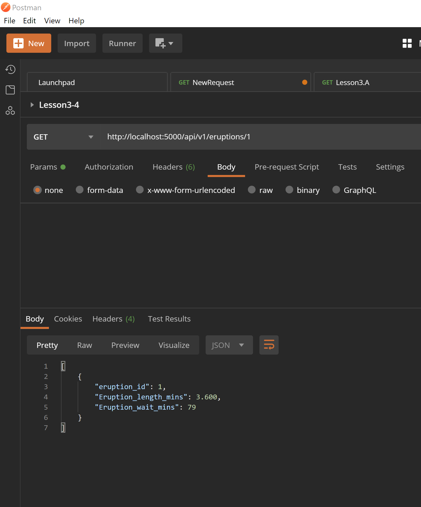
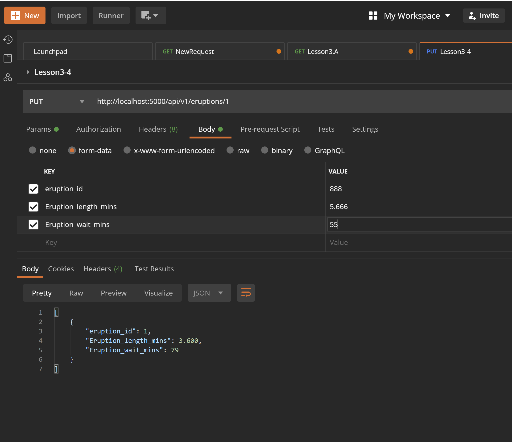
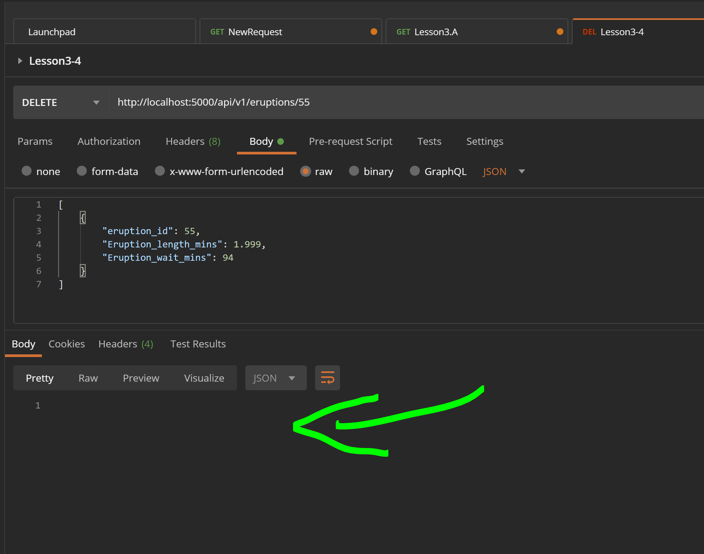

#Assignment 4

#Part A
##List of records in Postman

#Part B
##List one record in Postman

#Part C
##Create a record in Postman

#Part D
##Edit a record in Postman

#Part E
##Delete a record in Postman

